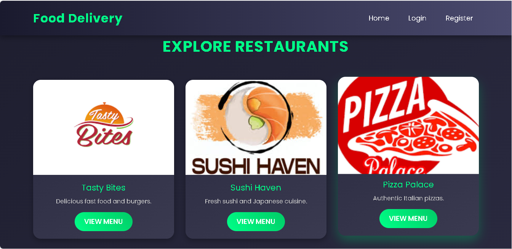

# Food Delivery Website

A **fully responsive**, sleek, and modern food delivery website built using **PHP, MySQL, HTML, CSS, JavaScript, and Bootstrap**. It allows users to browse restaurants, view menus, manage carts, and place orders. Includes a separate **admin panel** for backend management.

---

## Landing Page Preview

---

> **Preview:** To see screenshots, open the `Preview-website` folder.

---

## Features

### User Side
- User registration and secure login
- Browse restaurant listings and menu items
- Add items to a cart and place orders
- Mobile and desktop responsive UI

### Admin Panel
- Manage (add/edit/delete) restaurants and menu items
- View and manage user orders

### UI/UX
- Gradient backgrounds, neon accents & modern cards
- Horizontal navbar with a hamburger menu on mobile
- Stylish footer with social icons
- Smooth transitions and animations

### Security
- Passwords hashed using **bcrypt**
- Secure database interactions using **PDO prepared statements**
- Session-based user authentication

---

## Tech Stack

- **Frontend:** HTML, CSS, JavaScript, Bootstrap  
- **Backend:** PHP (with PDO)  
- **Database:** MySQL  
- **Dev Tools:** VS Code, XAMPP  

---

## Prerequisites

Install the following on **Windows 10**:
- [XAMPP](https://www.apachefriends.org/)
- [VS Code](https://code.visualstudio.com/)
- Web Browser (Chrome, Firefox, or Edge)
- (Optional) [Composer](https://getcomposer.org/)

### VSCode Extensions Recommended:
- PHP Intelephense
- Prettier
- Live Server (for frontend testing)

## Installation & Setup

Step 1: Clone the Repository

Place the project inside your XAMPP htdocs directory:

git clone <repo-url> C:\xampp\htdocs\food_delivery

---

Step 2: Start XAMPP

1. Open XAMPP Control Panel

2. Start both Apache and MySQL

---

Step 3: Import the Database

1. Visit: http://localhost/phpmyadmin

2. Create a new database named: food_delivery

3. Import the SQL file from: db/food_delivery.sql

Tables Created:

-users

-restaurants

-menu_items

-cart

-orders

-order_items

> Sample Admin Login:
Email: admin@example.com
Password: admin123

---

Step 4: Run the Website

-Visit in your browser:

 `http://localhost/food_delivery`

-Test Flow:

 Register/Login

 Browse & select a restaurant

 Add items to cart

 Checkout & place an order

-Admin Panel Access:

 `http://localhost/food_delivery/admin/index.php`

---

Step 5: Mobile Responsiveness Testing

1. Open browser Dev Tools (Press F12)

2. Toggle device mode

3. Test the hamburger menu and layout responsiveness

---

Common Issues & Fixes

> To be added soon based on user feedback and usage reports.

---

Deployment Guide (Live Hosting)

1. Upload the entire food_delivery/ folder to your live server's public directory

2. Set up a MySQL database and import db/food_delivery.sql

3. Update the includes/config.php file with your live database credentials

4. Ensure the assets/images/ folder is writable:

   -`chmod 777 assets/images`

5. Enable HTTPS with an SSL certificate

---

###Optional Enhancements

-Integrate payment gateways (Stripe, PayPal)

-Add email confirmations for orders and sign-ups

---

###Security Best Practices

-Use strong passwords, especially for the admin account

-Implement CSRF protection for all forms

-Validate and sanitize all user inputs

-Add login rate limiting to prevent brute-force attacks

---

###Future Improvements

-Payment integration with Stripe/PayPal

-Order tracking and user profile history

-Restaurant search and filtering

-Real-time order status updates using WebSockets

-Dark mode toggle for better UX

---

Contributing

Want to contribute to this project? Follow these steps:

1. Fork the repository

2. Create a new feature branch:

git checkout -b feature-name

3. Commit your changes:

git commit -m "Add feature"

4. Push your branch and open a Pull Request:

git push origin feature-name

---

License

This project is licensed under the MIT License.

---

Contact

For issues or feature suggestions, feel free to reach out:

Email: johnsonmunisi2021@gmail.com

GitHub Issues: Open an issue in this repository

